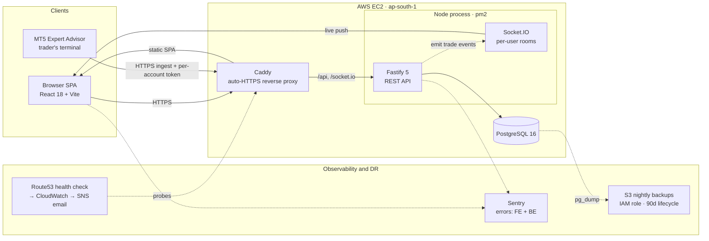
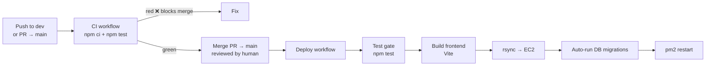

# PropVexis — Multi-Tenant Trading Journal SaaS

A production, multi-tenant SaaS that ingests closed trades from MetaTrader 5, stores them in PostgreSQL, and serves R-based performance analytics with live updates. Built and operated end-to-end — application, infrastructure, CI/CD, observability, and disaster recovery.

**Live:** https://app.propvexis.com (also https://journal.anishdevlops.xyz during migration)


---

## Runtime architecture



## CI/CD pipeline



Tests gate the release twice: on every PR/`dev` push (fast feedback) and again inside the deploy job (final backstop) — a red test aborts before anything reaches the server.

---

## Tech stack

| Layer | Technology |
|---|---|
| **API** | Node.js (ESM), Fastify 5, `pg` connection pool |
| **Real-time** | Socket.IO (cookie-authenticated, per-user rooms) |
| **Frontend** | React 18, Vite 6, React Router 6, Recharts, lightweight-charts |
| **Database** | PostgreSQL 16 (composite-indexed, migration-driven) |
| **Auth** | Google OAuth → JWT in an httpOnly + Secure cookie; per-`user_id` data isolation |
| **Ingestion** | MetaTrader 5 Expert Advisor (MQL5) → token-authed HTTPS upsert |
| **Edge** | Caddy (automatic HTTPS / Let's Encrypt), reverse proxy |
| **Process mgr** | pm2 |
| **CI/CD** | GitHub Actions (test-gated auto-deploy on merge to `main`) |
| **Cloud** | AWS EC2, S3, IAM, Route53, CloudWatch, SNS (ap-south-1) |
| **Observability** | Sentry (FE + BE), Prometheus + Grafana (RED metrics), Route53 uptime → CloudWatch → SNS email |
| **Payments** | Razorpay recurring subscriptions (Pro tier) |
| **Tests** | `node:test`, CI-gated |

---

## DevOps & platform highlights

- **Zero-touch CI/CD** — merge to `main` triggers a test-gated GitHub Actions pipeline: test → build → `rsync` to EC2 → auto-migrate → `pm2` restart. Sub-minute deploys.
- **Automated disaster recovery** — nightly `pg_dump` (custom format) to local disk **and** S3 via a least-privilege IAM **instance role** (no static keys on the box), 90-day S3 lifecycle expiry, restores verified with `pg_restore`.
- **Observability** — application error tracking (Sentry, front + back) plus black-box uptime monitoring (Route53 health check → CloudWatch alarm → SNS email) detecting outages within ~90s.
- **Security hardening** — IP-aware rate limiting behind the reverse proxy (`trustProxy`), fail-closed startup validation of production secrets, HTTPS-only `Secure` cookies, and least-privilege IAM scoping.
- **Database** — schema managed by an idempotent migration runner; composite indexes tuned for the hot scoped-and-ordered query paths (verified with `EXPLAIN`).
- **Multi-tenancy** — every query scoped by `user_id`; open self-serve Google signup gated behind an explicit flag.

---

## Features

- Live trade feed from MT5 (idempotent upsert; safe on EA retries/reconnects).
- R-based analytics: strike rate, expectancy, profit factor, equity curve, R-distribution, MFE efficiency, breakdowns by setup / session / instrument / day / week / month.
- **Prop Engine** — challenge tracking (drawdown / profit-target / trading-day rules) with equity snapshots and in-app breach / proximity / milestone alerts.
- Payout tracking, trade replay (M1 candles), CSV & manual entry, composed print/CSV reports.
- Free / Pro / Premium plans (Razorpay); god-view across all of a user's accounts.

---

## Local development

Requires Node 22+ and a reachable PostgreSQL 16.

```bash
# Backend
npm install
cp .env.example .env          # set DATABASE_URL, GOOGLE_CLIENT_ID, SESSION_SECRET, INGEST_TOKEN
npm run db:migrate            # apply migrations
npm run dev                   # http://localhost:3000
npm test                      # node:test suite

# Frontend
cd frontend && npm install && npm run dev   # Vite dev server, proxies /api → :3000
```

## Run with Docker

Containerized backend + PostgreSQL for dev/prod parity (production `Dockerfile`
is multi-stage, non-root, `tini` init, with a `/health` HEALTHCHECK):

```bash
docker compose up --build     # starts Postgres + backend, runs schema + migrations
curl localhost:3000/health    # {"ok":true}
```

The container image is the packaging artifact; the live deploy currently stays
rsync + pm2 (see below). Frontend runs separately via `vite`.

### Database connection pool

The `pg` pool is explicitly sized in [`src/platform/db.js`](src/platform/db.js) (`poolOptions`) from
`PG_POOL_*` env vars rather than riding node-pg's defaults, which capped the app at
10 clients and — with no `connectionTimeoutMillis` — made an exhausted pool queue
requests *forever* instead of erroring. Defaults: `max=20`, `idleTimeoutMillis=30s`,
`connectionTimeoutMillis=5s`, `maxUses=7500`. The pool also carries an `error`
listener, so a dead idle client (DB restart, `pg_terminate_backend`) is evicted and
logged instead of crashing the process on an unhandled error event.

**Sizing is per process.** Total connections to Postgres are
`cluster workers × PG_POOL_MAX`, and the prod/staging/dev environments share one
native PG16 instance (`max_connections=100`, 3 superuser-reserved). Check headroom
before raising it:

```bash
psql -c "show max_connections"
psql -c "select application_name, count(*) from pg_stat_activity group by 1 order by 2 desc"
```

Each pool tags itself `propvexis-<NODE_ENV>` via `application_name`, so that second
query attributes connections to the environment holding them. Pool saturation is
also exported to Prometheus (`pg_pool_total_connections`, `pg_pool_idle_connections`,
`pg_pool_waiting_requests` — a rising `waiting` count is the canonical signal that
`PG_POOL_MAX` is the bottleneck).

### Analytics aggregation & caching

Dashboard/analytics numbers are aggregated **in Postgres**, not in Node.
[`src/domain/analytics/statsSql.js`](src/domain/analytics/statsSql.js) builds one CTE query per request (headline,
every `GROUP BY` block, R-distribution, MFE, equity curve, and win/loss streaks
via gap-and-islands); [`src/domain/analytics/aggregations.js`](src/domain/analytics/aggregations.js) turns those
counts into the API shape.

The split is deliberate: **SQL does only `COUNT`/`SUM`/`GROUP BY`, and every
derived number — rounding, strike rate, averages, profit factor, expectancy,
group sort order — stays in JS.** So `shapePerf(countsFromSql)` must equal
`perf(theSameTrades)`, which `test/stats-sql.test.js` asserts directly against
the original implementation. A SQL mistake surfaces as a count mismatch, never as
a quietly different formula. All timestamp extraction is pinned to UTC, because
the JS original used `getUTC*` exclusively.

Rule **adherence** stays in JS — it evaluates JSONB rule predicates per trade,
which SQL can't express — but it is fetched separately and only for trades whose
strategy actually defines rules, so users with no rules pay nothing.

`/api/stats` and `/api/yearly` are cached per
`(kind, scope, unit, filters, rounding, year)` in
[`src/platform/statsCache.js`](src/platform/statsCache.js), invalidated on every write to that
user's trades (ingest, manual add, edit, delete, CSV import, strategy
rename/rules edit). The cache is bounded (LRU + TTL backstop) because the box has
1GB of RAM, and scoped per user so one trader's ingest can't flush everyone's.
`stats_cache_*` metrics expose the hit ratio.

### Redis (optional) — shared socket adapter + cache invalidation

`REDIS_URL` unset means the app behaves exactly as it does single-process:
in-memory Socket.IO adapter, process-local analytics cache. Set it and two things
become cross-process, which is what makes multiple workers possible:

- **Socket.IO** uses `@socket.io/redis-adapter`, so a broadcast reaches clients
  connected to any worker.
- **Cache invalidation** fans out over Redis pub/sub
  ([`src/platform/statsBus.js`](src/platform/statsBus.js)), so a trade written on one worker drops
  the stale entries on all of them.

Two availability rules are deliberate in [`src/platform/redis.js`](src/platform/redis.js): a failed
connect is **not fatal** (the app logs and runs degraded rather than refusing to
boot — a Redis outage must not take the API down), and both clients get `error`
listeners before connecting, since an unhandled `error` event would kill the
process. The `redis_configured` / `redis_connected` gauges make "configured but
currently down" alertable, because the socket adapter goes quietly one-way then.

The invariant in the invalidation bus: **local invalidation never depends on the
transport.** If the publish fails, the worker that handled the write still drops
its own entries — otherwise a Redis outage would show the writing user their own
stale dashboard, which is worse than the cross-worker staleness this fixes.

`redis://` and `rediss://` (TLS) both work, so one var covers a native
`redis-server`, Upstash, or ElastiCache.

### Multiple workers (pm2 cluster mode)

Wired up in [`ecosystem.config.cjs`](ecosystem.config.cjs) but **shipped as one
worker per env**. `exec_mode` flips to `cluster` automatically when `WORKERS` goes
above 1. The two correctness blockers — shared socket adapter and shared cache
invalidation — are **solved in code** by the Redis layer above. What remains
before raising it:

1. **Provision Redis** and set `REDIS_URL` for that env. Without it, clustered
   workers drop realtime events and serve stale analytics.
2. **Box headroom** — a 1GB t3.micro runs all three envs today (the Prometheus and
   Grafana containers are stopped on purpose to fit). Each worker is ~90–150MB
   RSS, so a second prod worker needs an upsize.
3. **Lower `PG_POOL_MAX`** — total connections are `workers × PG_POOL_MAX` across
   three envs against `max_connections=100`; `advisePoolMax()` in
   [`src/platform/cluster.js`](src/platform/cluster.js) computes the ceiling.

[`src/platform/cluster.js`](src/platform/cluster.js) re-checks at boot from **live** Redis state
(not boot-time config, since Redis can drop later) and logs `UNSAFE CLUSTER MODE`
per reason, with the `app_unsafe_cluster_mode` gauge as the alarm.

> The box's Docker daemon is stopped to save memory, so Redis there wants a native
> `apt install redis-server` bound to `127.0.0.1` (~10MB), not a container.

### Metrics (Prometheus + Grafana)

The backend exposes Prometheus metrics at `GET /metrics` — RED metrics (request
rate, error rate, latency histogram) labeled by route template, plus Node
runtime (CPU, memory, event-loop lag, GC) and `pg` pool saturation. A monitoring
stack ships under a compose profile so the default stack stays lightweight:

```bash
docker compose --profile monitoring up -d   # app + Prometheus + Grafana
# Prometheus → http://localhost:9090
# Grafana    → http://localhost:3001  (admin / admin) — dashboard auto-provisioned
```

Grafana auto-loads the Prometheus datasource and the **Amey Journal — Backend**
dashboard. `/metrics` is unauthenticated by default (safe: the backend binds
loopback and Caddy does not proxy it); set `METRICS_TOKEN` for a bearer guard.

**In production** the stack runs as containers on the EC2 box (host networking,
so Prometheus scrapes the loopback-bound backend) and is brought up automatically
by the deploy pipeline (`docker-compose.monitoring.prod.yml` via a separate
`monitoring` job). Grafana is published at **https://grafana.anishdevlops.xyz**,
fronted by Caddy (TLS) and gated by Grafana's own login — it binds `127.0.0.1`
only, so Caddy is the sole path in. Set the `GRAFANA_PASSWORD` GitHub secret for
the admin login. Two **one-time** setup steps (not auto-deployed, since DNS and
the on-box Caddyfile live outside this repo):

1. **DNS** — add an A record `grafana.anishdevlops.xyz` → the box's Elastic IP.
2. **Caddy** — `import` the shipped copy by adding
   `import /opt/amey-journal/monitoring/caddy/grafana.caddy` to the box's
   `/etc/caddy/Caddyfile`, then `sudo systemctl reload caddy`.

After that, edits to [`monitoring/caddy/grafana.caddy`](monitoring/caddy/grafana.caddy)
are hands-off: the deploy's `monitoring` job runs `scripts/caddy-reload-if-changed.sh`,
which validates and reloads Caddy **only when the snippet's content changed**
(tracked by a hash stamp) — a no-op on every other deploy.

## Deployment

Merge to `main` → GitHub Actions deploys to a single EC2 host: builds the SPA, `rsync`s `src db scripts ea ecosystem.config.cjs` + `frontend/dist`, runs migrations, and reloads pm2 via `startOrReload ecosystem.config.cjs` (which applies the version-controlled bootstrap env). Caddy serves the SPA and reverse-proxies `/api`, `/socket.io`, and `/health` to the Node process.

### Secrets (AWS SSM Parameter Store)

In production the backend loads its secrets from **SSM Parameter Store**
(SecureString/KMS) at boot, via the EC2 **instance IAM role** — no static AWS keys
and no secret values on disk. The entry point ([`src/server.js`](src/server.js))
hydrates `process.env` from SSM ([`src/platform/secrets.js`](src/platform/secrets.js)) *before* config
is read, then loads the app. It's gated on the box env var `SSM_PREFIX`: unset (local
dev, tests, CI, any un-migrated box) it's a pure no-op and `dotenv`/`.env` is used as
before; set (e.g. `/amey-journal/prod/`) it fetches every parameter under that path
and **fails closed** if SSM is unreachable or empty. The read permission is codified
least-privilege in [`terraform/secrets.tf`](terraform/secrets.tf); see
[`terraform/README.md`](terraform/README.md) for the parameter-creation runbook.

## Project structure

```
src/
  server.js     entry: hydrate SSM secrets, then import the app
  app.js        wiring only — Fastify, CORS, rate limit, auth, Socket.IO, Redis, metrics hook
  routes/       the HTTP layer, one module per domain; called on the root instance, not registered
  platform/     infrastructure with no domain model — config, db, redis, secrets, cluster,
                metrics, paths, calendar, and platform/auth/
  domain/       business logic, mirroring routes/: trades, accounts, prop, finance,
                journal, analytics, billing, alerts
db/             base schema + incremental migrations (runner: scripts/migrate.js)
frontend/       React + Vite SPA
ea/             MQL5 Expert Advisor (MT5 ingestion client)
scripts/        migrate, backup (pg_dump → S3), import, smoke tests
test/           node:test suites (CI-gated)
.github/        ci.yml (PR/dev tests) + deploy.yml (test-gated auto-deploy)
```

## Roadmap

- **Connector layer** — pluggable trade-sync sources feeding one ingestion seam (CSV/EA free; MetaApi cloud sync + cTrader next), with a horizontally-scaled sync-worker fleet.
- **Staging + supply-chain CI** — a Terraform-provisioned staging env, a container registry (GHCR/ECR), and Dependabot/Trivy scanning.

---

*Solo-built full-stack + DevOps project.*
