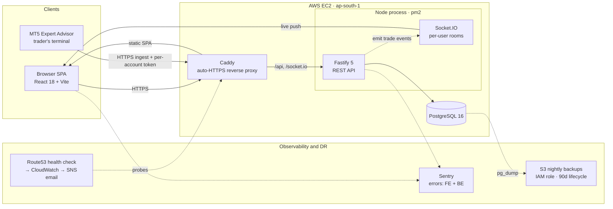
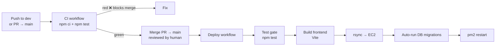

# PATIL TRADES — Multi-Tenant Trading Journal SaaS

A production, multi-tenant SaaS that ingests closed trades from MetaTrader 5, stores them in PostgreSQL, and serves R-based performance analytics with live updates. Built and operated end-to-end — application, infrastructure, CI/CD, observability, and disaster recovery.

**Live:** https://journal.anishdevlops.xyz


---

## Runtime architecture



## CI/CD pipeline



Tests gate the release twice: on every PR/`dev` push (fast feedback) and again inside the deploy job (final backstop) — a red test aborts before anything reaches the server.

---

## Tech stack

| Layer | Technology |
|---|---|
| **API** | Node.js (ESM), Fastify 5, `pg` connection pool |
| **Real-time** | Socket.IO (cookie-authenticated, per-user rooms) |
| **Frontend** | React 18, Vite 6, React Router 6, Recharts, lightweight-charts |
| **Database** | PostgreSQL 16 (composite-indexed, migration-driven) |
| **Auth** | Google OAuth → JWT in an httpOnly + Secure cookie; per-`user_id` data isolation |
| **Ingestion** | MetaTrader 5 Expert Advisor (MQL5) → token-authed HTTPS upsert |
| **Edge** | Caddy (automatic HTTPS / Let's Encrypt), reverse proxy |
| **Process mgr** | pm2 |
| **CI/CD** | GitHub Actions (test-gated auto-deploy on merge to `main`) |
| **Cloud** | AWS EC2, S3, IAM, Route53, CloudWatch, SNS (ap-south-1) |
| **Observability** | Sentry (FE + BE), Route53 uptime → CloudWatch → SNS email |
| **Payments** | Razorpay recurring subscriptions (Pro tier) |
| **Tests** | `node:test`, CI-gated |

---

## DevOps & platform highlights

- **Zero-touch CI/CD** — merge to `main` triggers a test-gated GitHub Actions pipeline: test → build → `rsync` to EC2 → auto-migrate → `pm2` restart. Sub-minute deploys.
- **Automated disaster recovery** — nightly `pg_dump` (custom format) to local disk **and** S3 via a least-privilege IAM **instance role** (no static keys on the box), 90-day S3 lifecycle expiry, restores verified with `pg_restore`.
- **Observability** — application error tracking (Sentry, front + back) plus black-box uptime monitoring (Route53 health check → CloudWatch alarm → SNS email) detecting outages within ~90s.
- **Security hardening** — IP-aware rate limiting behind the reverse proxy (`trustProxy`), fail-closed startup validation of production secrets, HTTPS-only `Secure` cookies, and least-privilege IAM scoping.
- **Database** — schema managed by an idempotent migration runner; composite indexes tuned for the hot scoped-and-ordered query paths (verified with `EXPLAIN`).
- **Multi-tenancy** — every query scoped by `user_id`; open self-serve Google signup gated behind an explicit flag.

---

## Features

- Live trade feed from MT5 (idempotent upsert; safe on EA retries/reconnects).
- R-based analytics: strike rate, expectancy, profit factor, equity curve, R-distribution, MFE efficiency, breakdowns by setup / session / instrument / day / week / month.
- **Prop Engine** — challenge tracking (drawdown / profit-target / trading-day rules) with equity snapshots and in-app breach / proximity / milestone alerts.
- Payout tracking, trade replay (M1 candles), CSV & manual entry, composed print/CSV reports.
- Free / Pro / Premium plans (Razorpay); god-view across all of a user's accounts.

---

## Local development

Requires Node 20+ and a reachable PostgreSQL 16.

```bash
# Backend
npm install
cp .env.example .env          # set DATABASE_URL, GOOGLE_CLIENT_ID, SESSION_SECRET, INGEST_TOKEN
npm run db:migrate            # apply migrations
npm run dev                   # http://localhost:3000
npm test                      # node:test suite

# Frontend
cd frontend && npm install && npm run dev   # Vite dev server, proxies /api → :3000
```

## Run with Docker

Containerized backend + PostgreSQL for dev/prod parity (production `Dockerfile`
is multi-stage, non-root, `tini` init, with a `/health` HEALTHCHECK):

```bash
docker compose up --build     # starts Postgres + backend, runs schema + migrations
curl localhost:3000/health    # {"ok":true}
```

The container image is the packaging artifact; the live deploy currently stays
rsync + pm2 (see below). Frontend runs separately via `vite`.

## Deployment

Merge to `main` → GitHub Actions deploys to a single EC2 host: builds the SPA, `rsync`s `src db scripts ea` + `frontend/dist`, runs migrations, and restarts pm2. Caddy serves the SPA and reverse-proxies `/api`, `/socket.io`, and `/health` to the Node process. `.env` lives only on the box (never in the repo or the sync).

## Project structure

```
src/            Fastify API, Socket.IO, auth, scoping, analytics, money-math, Sentry init
db/             base schema + incremental migrations (runner: scripts/migrate.js)
frontend/       React + Vite SPA
ea/             MQL5 Expert Advisor (MT5 ingestion client)
scripts/        migrate, backup (pg_dump → S3), import, smoke tests
test/           node:test suites (CI-gated)
.github/        ci.yml (PR/dev tests) + deploy.yml (test-gated auto-deploy)
```

## Roadmap

- **Connector layer** — pluggable trade-sync sources feeding one ingestion seam (CSV/EA free; MetaApi cloud sync + cTrader next), with a horizontally-scaled sync-worker fleet.
- **Infrastructure as Code** — Terraform for the EC2 / S3 / IAM / Route53 / CloudWatch stack.
- **Metrics** — Prometheus + Grafana dashboards to complete the observability picture.

---

*Solo-built full-stack + DevOps project.*
